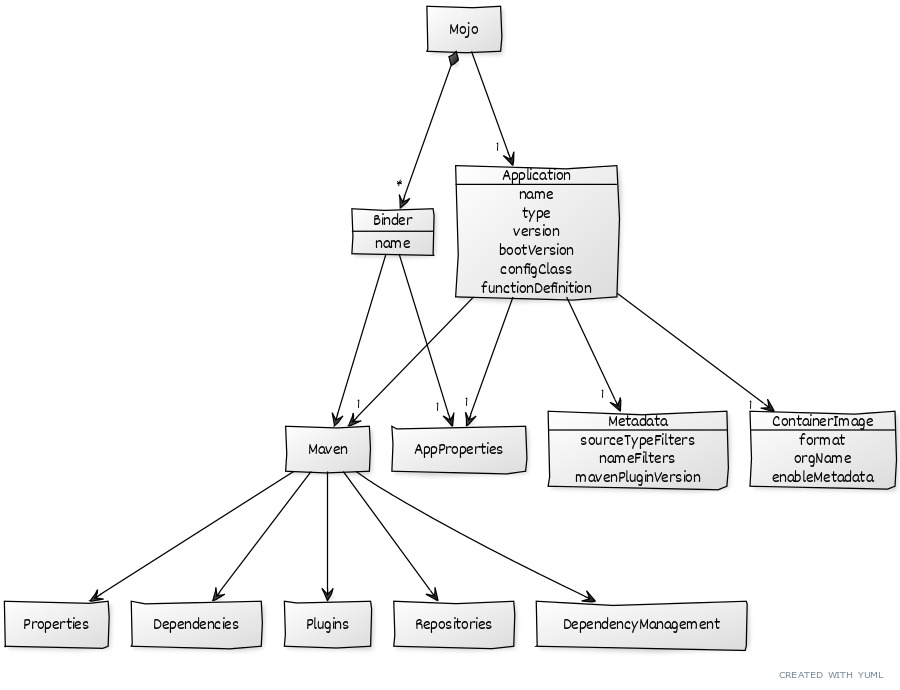

= spring-cloud-dataflow-apps-generator-plugin

Maven plugin for generating https://github.com/spring-cloud/stream-applications[Spring Cloud Stream Applications].

It generates a separate maven project for every configured binder.

Plugin `Application` section helps to configure the application project independently form the Binders that can be used.

The `Binders` section helps to define the Binder specific configurations, that are merged to the `Application` configurations to generate the binder specific maven projects.

The `Global` section (e.g. `global.application` and `global.binders`) helps to define configurations sharable between many Applications and Binders.

As the following diagram illustrates, both the `Application` and the
`Binder` allow configuring various application and maven properties:

== Build
Java 17 required.
[source, bash]
----
mvn clean package
----

== Sample Configuration

In the parent POM define the `Application` and `Binder` configurations common for all applications to be generated.
Do this under the `pluginManagement` pom section and use the plugin's `global` configuration:

[source, xml]
----
<pluginManagement>
  <plugins>
    <plugin>
        <groupId>org.springframework.cloud</groupId>
        <artifactId>spring-cloud-dataflow-apps-generator-plugin</artifactId>
        <version>1.1.0-SNAPSHOT</version>
        <executions>
            <execution>
                <id>app-gen</id>
                <phase>package</phase>
                <goals>
                    <goal>generate-app</goal>
                </goals>
            </execution>
        </executions>
        <configuration>
            <generatedProjectHome>${basedir}/apps</generatedProjectHome>
            <global>
                <application>
                    <bootVersion>${spring-boot.version}</bootVersion>
                    <containerImage>
                        <orgName>yourOrgNameGoesHere</orgName>
                        <enableMetadata>true</enableMetadata>
                    </containerImage>
                    <properties>
                        <!-- Your common properties go here  -->
                    </properties>
                    <metadata>
                        <mavenPluginVersion>1.1.0-SNAPSHOT</mavenPluginVersion>
                    </metadata>
                    <maven>
                        <dependencyManagement>
                            <!-- Your dependency mgmt goes here -->
                        </dependencyManagement>
                        <dependencies>
                            <!-- Your dependencies go here -->
                        </dependencies>
                    </maven>
                </application>
                <binders>
                    <kafka>
                        <maven>
                            <dependencies>
                                <dependency>
                                    <groupId>org.springframework.cloud</groupId>
                                    <artifactId>spring-cloud-stream-binder-kafka</artifactId>
                                </dependency>
                            </dependencies>
                        </maven>
                    </kafka>
                    <rabbit>
                        <maven>
                            <dependencies>
                                <dependency>
                                    <groupId>org.springframework.cloud</groupId>
                                    <artifactId>spring-cloud-stream-binder-rabbit</artifactId>
                                </dependency>
                            </dependencies>
                        </maven>
                    </rabbit>
                </binders>
            </global>
        </configuration>
    </plugin>
  </plugins>
</pluginManagement>
----

Above global configurations will be reused by all children applications.

In addition, the child application can add application specific configurations, contributed to the inherited from
to the global:

[source, xml]
----
<plugins>
  <plugin>
      <groupId>org.springframework.cloud</groupId>
      <artifactId>spring-cloud-dataflow-apps-generator-plugin</artifactId>
      <version>1.1.0-SNAPSHOT</version>
      <configuration>
          <application>
              <name>syslog</name>
              <type>source</type>
              <version>${project.version}</version>
              <configClass>org.springframework.cloud.fn.supplier.syslog.SyslogSupplierConfiguration.class</configClass>
              <maven>
                  <dependencies>
                      <dependency>
                          <groupId>org.springframework.cloud.fn</groupId>
                          <artifactId>syslog-supplier</artifactId>
                      </dependency>
                      <dependency>
                          <groupId>org.springframework.cloud.stream.app</groupId>
                          <artifactId>stream-applications-composite-function-support</artifactId>
                          <version>${stream-apps-core.version}</version>
                      </dependency>
                  </dependencies>
              </maven>
          </application>
      </configuration>
  </plugin>
</plugins>
----
